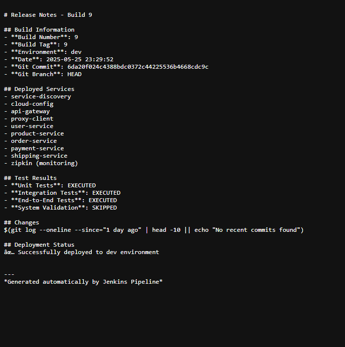

# WORKSHOP 2: TESTING AND RELEASE - RESULTS REPORT

## 1. Introduction

- **Workshop Objective:** Configure CI/CD pipelines for building, testing, and deploying a microservices-based e-commerce application, implementing a comprehensive set of tests to ensure system quality and performance.
- **Project Description:** The project is based on the e-commerce application `ecommerce-microservice-backend-app` ([GitHub](https://github.com/SelimHorri/ecommerce-microservice-backend-app/)), which implements a microservices architecture.
- **Importance of CI/CD and Testing:** The criticality of establishing automated continuous integration, continuous delivery processes, and a testing regime in microservices architectures is highlighted to ensure system agility, reliability, and maintainability.

---

## 2. Selection of Microservices

- The following microservices from the project were selected for pipeline and testing configuration:
  - `api-gateway`
  - `cloud-config`
  - `order-service`
  - `payment-service`
  - `product-service`
  - `proxy-client`
  - `service-discovery`
  - `user-service`
  - `zipkin` (for observability)
- The microservice `favourite-service` was excluded from the scope of this workshop.
- **Justification:** These services were chosen due to their interdependence and because they represent critical business flows in e-commerce, allowing for meaningful integration and E2E tests. For example, `proxy-client` acts as an orchestrator for many requests, interacting with `user-service`, `product-service`, `order-service`, which in turn may communicate with `payment-service`. `api-gateway` serves as a single entry point, while `service-discovery` and `cloud-config` are crucial for infrastructure.

---

## 3. Environment Setup

### Initial Phase on Azure

- A Virtual Machine (VM) was provisioned in Microsoft Azure to host the Jenkins server.
- Jenkins was configured on this VM, installing the necessary plugins for continuous integration and deployment, including those for Kubernetes interaction. Plugins like Azure Credentials may have been used to securely manage Azure credentials.
- In parallel, Azure Kubernetes Service (AKS) was configured to create a managed Kubernetes cluster. AKS simplifies the deployment and management of Kubernetes clusters.
- Azure Container Registry (ACR) was set up for storing and managing Docker images of the microservices. ACR is a private registry that integrates with AKS and other CI/CD tools.


### Transition to Local Environment

- Due to the expiration of Azure credits, the work environment was migrated to a local setup.
- **Local Jenkins:** Jenkins was instantiated inside a Docker container, maintaining portability and consistency of the CI environment.
- **Local Kubernetes:** Docker Desktop was used to create and manage a local Kubernetes cluster. Docker Desktop provides an easy-to-use single-node Kubernetes environment for development and testing.
- **Local Container Registry:** A local Docker registry (`host.docker.internal:5000`) was used for built images.


### Key Jenkins Plugins Used

- **Pipeline Plugin:** Fundamental for defining pipelines as code (Jenkinsfile).
- **Docker Pipeline Plugin:** For building, tagging, and pushing Docker images.
- **Kubernetes Plugin:** To interact with the Kubernetes cluster, manage deployments, and dynamic agents.
- **Git Plugin:** To fetch source code from the GitHub repository.
- **GitHub Integration Plugin:** For integration with GitHub, including webhooks.
- **Maven Integration Plugin:** For building Java/Maven projects.
- **HTML Publisher Plugin:** To publish HTML reports generated during the build (e.g., Locust performance test reports).

### Jenkins Job Configuration

The Jenkins pipeline is configured to monitor the `dev`, `stage`, and `master` branches of the Git repository:


When the pipeline is triggered—either manually or automatically—it utilizes several configurable parameters that control the execution flow and target environment:


These parameters are defined in the `parameters` section of the `Jenkinsfile` and allow for flexible management of the pipeline according to the needs of each environment and deployment scenario.

### Base configuration for Jenkins

```groovy
pipeline {
    agent any

    environment {
        DOCKER_REGISTRY = 'host.docker.internal:5000'
        K8S_CONTEXT = 'docker-desktop'
        K8S_TARGET_NAMESPACE = 'ecommerce-app'
        MAVEN_OPTS = '-Xmx1024m'
    }

    parameters {
        choice(
            name: 'ENVIRONMENT',
            choices: ['dev', 'stage', 'master'],
            description: 'Environment to deploy to'
        )
        string(
            name: 'BUILD_TAG',
            defaultValue: "${env.BUILD_ID}",
            description: 'Tag para la imagen Docker'
        )
        booleanParam(
            name: 'SKIP_TESTS',
            defaultValue: false,
            description: 'Skip all tests (emergency deployment only)'
        )
        booleanParam(
            name: 'GENERATE_RELEASE_NOTES',
            defaultValue: true,
            description: 'Generate automatic release notes'
        )
        choice(
            name: 'PERFORMANCE_TEST_LEVEL',
            choices: ['standard', 'light', 'stress'],
            description: 'Performance test intensity level (only applies in master environment)'
        )
        booleanParam(
            name: 'SKIP_PERFORMANCE_TESTS',
            defaultValue: false,
            description: 'Skip performance tests specifically (even in master environment)'
        )
    }
}
```

---

## 4. Development Pipelines (Dev Environment)

- `dev`, `stage`, and `master` branches were defined to manage the development flow.
- An initial pipeline was configured in Jenkins (for the `dev` environment) with the main goal of validating connectivity and the basic build and packaging process of the microservices.

### `dev` Pipeline Process

- **Trigger:** Initially configured with a webhook in the GitHub repository to trigger on `push` to the `dev` branch.
- **Checkout:** Downloads the source code from GitHub.
- **Build:** Compiles the microservices using Maven.
- **Docker Build & Push:** Builds Docker images for each microservice and pushes them to the container registry (initially Azure ACR, then the local registry).
  - The `buildAndPushDockerImage` function in the Jenkinsfile handles this.
- A Kubernetes namespace called `ecommerce-app` was created to organize resources.
- Kubernetes YAML manifests (`deployment.yaml`, `service.yaml`) were developed for each microservice, plus a central configuration file `common-config.yaml`.

### `dev` Pipeline Configuration

- The pipeline is defined in the `Jenkinsfile` at the root of the repository. For the development environment (`dev`), the parameter `ENVIRONMENT=dev` must be selected when running the pipeline in Jenkins. The pipeline includes stages such as:

  - **Checkout & Workspace Verification**: Downloads the source code and verifies the workspace structure.
  - **Unit Tests**: Runs unit tests for the main microservices (only if `SKIP_TESTS` is `false`).
  - **Integration Tests**: Runs integration tests (only if `SKIP_TESTS` is `false`).
  - **End-to-End Tests**: Runs E2E tests (only if `SKIP_TESTS` is `false`).
  - **Generate Release Notes**: Automatically generates release notes (if `GENERATE_RELEASE_NOTES` is `true`).
  - **Performance Tests**: Runs performance tests according to the level defined in `PERFORMANCE_TEST_LEVEL` (default `standard`).

```groovy
stage('Unit Tests') {
    when {
        expression { params.SKIP_TESTS == false }
    }
    steps {
        script {
            echo "=== UNIT TESTS ==="
            def microservices = [ /* ... */ ]
            microservices.each { service ->
                try {
                    dir("${env.DOCKERFILE_DIR_ROOT}/${service}") {
                        sh "./mvnw clean test -Dtest=${testPattern} -DfailIfNoTests=false -Dmaven.test.failure.ignore=true"
                    }
                } catch (Exception e) {
                    echo "❌ Pruebas unitarias fallaron para ${service}: ${e.message}"
                    if (params.ENVIRONMENT == 'master') {
                        error "Pruebas unitarias críticas fallaron en ${service}"
                    }
                }
            }
        }
    }
}
```

Stage of build and package

```groovy
stage('Build & Package') {
    steps {
        script {
            echo "=== BUILD & PACKAGE ==="
            def microservices = [ /* ... */ ]
            microservices.each { service ->
                try {
                    echo "Construyendo ${service}..."
                    dir("${env.DOCKERFILE_DIR_ROOT}/${service}") {
                        sh "./mvnw clean package -DskipTests"
                    }
                } catch (Exception e) {
                    error "❌ Error construyendo ${service}: ${e.message}"
                }
            }
        }
    }
}
```

Stage of push images

```groovy
stage('Docker Build & Push') {
    steps {
        script {
            echo "=== DOCKER BUILD & PUSH ==="
            def microservices = [ /* ... */ ]
            microservices.each { service ->
                buildAndPushDockerImage(service, params.BUILD_TAG)
            }
        }
    }
}

def buildAndPushDockerImage(String serviceName, String buildTag) {
    echo "Construyendo imagen Docker para ${serviceName}..."
    def imageName = "${env.DOCKER_REGISTRY}/${serviceName}:${buildTag}"
    def contextPath = "${env.DOCKERFILE_DIR_ROOT}/${serviceName}"
    dir(contextPath) {
        sh "docker build -t ${imageName} ."
        try {
            sh "docker push ${imageName}"
            echo "✓ Imagen ${imageName} subida al registry"
        } catch (Exception e) {
            echo "⚠️ No se pudo subir al registry, usando imagen local: ${e.message}"
        }
    }
}
```

    The build, deployment, and other stages may be commented out or enabled depending on the environment and needs. The `ENVIRONMENT` parameter controls pipeline behavior for the `dev`, `stage`, and `master` environments.

### `dev` Pipeline Result


### Analysis

- This pipeline allowed verification of the correct integration between Jenkins, GitHub, Docker, and the Container Registry, serving as a foundation for the more complex `stage` and `master` pipelines.

### Release Notes (Dev)



---

## 5. Test Implementation

- A test plan documented in `TESTING_PLAN.md` was developed before implementation.

### 5.1. Unit Tests

- **Objective:** Validate individual components in isolation.
- **Strategy:** Focused on the internal logic of the services, including DTO processing, business calculations, and correct interaction with dependency mocks.
- **Implemented Examples:**
  1. `user-service` - `UserServiceImplTest.testSaveUser_ShouldProcessInputCorrectlyAndReturnExpectedResult()`: Validated user creation logic, DTO mapping, and role assignment.
  2. `order-service` - `OrderServiceImplTest.testSave_ShouldCalculateAndSaveOrderCorrectly()`: Validated order creation, `orderFee` calculation, and date handling.
  3. `payment-service` - `PaymentServiceImplTest.testSave_ShouldProcessPaymentCorrectlyAndReturnExpectedResult()`: Validated `PaymentDto` processing, `COMPLETED` status, and order association.
  4. `shipping-service` - `OrderItemServiceImplTest.testSave_ShouldProcessOrderItemCorrectlyAndCalculateShippingData()`: (Planned) Validated `OrderItem` processing and shipping data calculation.
  5. `proxy-client` - `ProductControllerTest.testFindById_ShouldReturnProductDtoWhenClientServiceReturnsValidResponse()`: Validated the proxy controller, mocking the Feign client for `ProductClientService`.


### 5.2. Integration Tests

- **Objective:** Validate communication and interaction between microservices.
- **Strategy:** Tested communication flows between `proxy-client` and other services, as well as backend service interaction. The use of mocks was considered.
- **Implemented Examples:**
  1. `proxy-client` <-> `user-service` (User Creation): Verified that `POST /users` in `proxy-client` correctly calls `user-service`.
  2. `proxy-client` <-> `product-service` (Get Product): Verified that `GET /products/{id}` in `proxy-client` correctly calls `product-service`.
  3. `order-service` -> `payment-service` (Payment Processing): Verified the call from `order-service` to `payment-service` for payment processing.
  4. `order-service` -> `shipping-service` (Shipping Management): (Planned) Verified the call from `order-service` to `shipping-service` for shipping.
  5. `api-gateway` -> `proxy-client` (Basic Routing): Verified routing from `api-gateway` to `proxy-client`.


### 5.3. End-to-End (E2E) Tests

- **Objective:** Validate complete user flows through the system.
- **Strategy:** Simulated user interactions from the `api-gateway` through multiple microservices.
- **Implemented Examples:**
  1. User Registration Flow: `api-gateway` -> `proxy-client` -> `user-service`.
  2. Product Detail Viewing Flow: `api-gateway` -> `proxy-client` -> `product-service`.
  3. Simplified Order Creation Flow: `api-gateway` -> `proxy-client` (queries `product-service`, calls `order-service`).
  4. Existing Order Payment Flow: `api-gateway` -> `proxy-client` -> `order-service` -> `payment-service`.
  5. Paid Order Shipping Start Flow: (Planned, depends on `shipping-service`) `api-gateway` -> `proxy-client` -> `order-service` -> `shipping-service`.

  

### 5.4. Performance and Stress Tests (Locust)

- **Tool:** Locust.
- **Objective:** Evaluate the system's response, stability, and scalability under different load levels (standard, light, stress).
- **Strategy:** Scenarios were defined in `locustfile.py` (integrated in `performance_test_suite.py`) to simulate real use cases.
- **Simulated Use Cases:**
  1. Product Listing Load: (`proxy-client` -> `product-service`).
  2. Order Creation Performance: (`proxy-client` -> `order-service`, with secondary impact on `payment-service`).
  3. `user-service` Response Capacity: (User operations via `proxy-client`).
- **Configuration:** The Jenkinsfile includes parameters for `PERFORMANCE_TEST_LEVEL` (`standard`, `light`, `stress`) that adjust the number of users, spawn rate, and test duration. The `runPerformanceTests` function handles execution.
- **Key Metrics:** Response time, throughput (requests/second), error rate.

```groovy
stage('Performance Tests') {
    steps {
        script {
            echo "=== PERFORMANCE TESTS ==="
            echo "🎛️ Performance Test Level: ${params.PERFORMANCE_TEST_LEVEL}"
            try {
                runPerformanceTests()
                echo "✓ Pruebas de rendimiento completadas"
            } catch (Exception e) {
                echo "⚠️ Pruebas de rendimiento fallaron: ${e.message}"
                if (params.ENVIRONMENT == 'master') {
                    error "Pruebas de rendimiento críticas fallaron en ambiente master"
                }
            }
        }
    }
    post { 
        always {
            archiveArtifacts artifacts: 'performance-tests/performance_results/**/*', allowEmptyArchive: true
        }
    }
}

def runPerformanceTests() {
    dir('performance-tests') {
        def testConfig = [:]
        switch(params.PERFORMANCE_TEST_LEVEL) {
            case 'light':
                testConfig = [users: 10, spawnRate: 1, duration: 60]
                break
            case 'stress':
                testConfig = [users: 50, spawnRate: 5, duration: 300]
                break
            default: // standard
                testConfig = [users: 20, spawnRate: 2, duration: 120]
        }
        sh """
            python3 performance_test_suite.py --all \\
                --users ${testConfig.users} \\
                --spawn-rate ${testConfig.spawnRate} \\
                --duration ${testConfig.duration} \\
                --host http://host.docker.internal || echo "⚠️ Algunas pruebas de rendimiento fallaron"
        """
    }
}
```

#### Performance Test Results

Performance tests conducted with Locust showed the following results:

**Overall System Throughput:**
- **Total requests processed:** 1,017 requests
- **Requests per second rate:** 15.73 requests/s (aggregate average)
- **Error rate:** 0% (no failures during execution)

**Response Time by Endpoint:**

| Endpoint | Requests | Average Time (ms) | Median Time (ms) | P95 (ms) | P99 (ms) | Max (ms) |
|----------|------------|---------------------|---------------------|----------|----------|----------|
| `GET /api/products` (load) | 511 | 28.4 | 10 | 100 | 180 | 252.5 |
| `GET /api/products/{id}` (load) | 353 | 24.3 | 10 | 86 | 170 | 255.1 |
| `GET /api/products` | 61 | 35.5 | 11 | 110 | 180 | 181.4 |
| `GET /api/products/{id}` | 39 | 34.2 | 9 | 120 | 260 | 263.6 |
| `GET /api/categories/{id}` | 17 | 29.4 | 13 | 130 | 130 | 128.0 |

**Performance Analysis:**
- **Excellent success rate:** 100% of requests were successful with no HTTP errors.
- **Consistent response time:** Most endpoints maintain response times below 100ms at the 95th percentile.
- **Sustained throughput:** The system maintained a stable throughput of ~15.7 req/s throughout the test.
- **Scalability:** The "load" endpoints (high load) showed better performance than individual endpoints, indicating optimization for batch operations.


**Integration with Jenkins Pipeline:**

Performance tests are fully integrated into the Jenkinsfile with the following features:

1. **Automatic configuration by level:**
   - **Light**: 10 users, spawn rate 1/sec, duration 60 seconds (quick validation)
   - **Standard**: 20 users, spawn rate 2/sec, duration 120 seconds (balanced CI/CD)
   - **Stress**: 50 users, spawn rate 5/sec, duration 300 seconds (limit validation)

2. **Pre-service verification:**
   - Automatic connectivity check of critical endpoints
   - Validation of API Gateway and core services availability
   - 60-second stabilization time before starting tests

3. **Automatic execution:**
   - Automatic installation of Python dependencies (Locust, requests, pandas)
   - Execution of the `performance_test_suite.py` script with dynamic parameters
   - Automatic generation of HTML, JSON, and CSV reports

4. **Artifact handling:**
   - Results are automatically archived as Jenkins build artifacts
   - Generation of consolidated report `ci_summary.md` with key metrics
   - Preservation of all result files in `performance_results/`

5. **Failure control:**
   - In `master` environment: Performance test failures stop the pipeline
   - In `dev/stage` environments: Pipeline continues with warnings
   - Automatic log capture for debugging in case of failure

6. **Parametrizable configuration:**
   - `PERFORMANCE_TEST_LEVEL` parameter controls intensity
   - `SKIP_PERFORMANCE_TESTS` parameter allows skipping tests
   - Specific configuration per environment

For each run, the results are available as build artifacts in Jenkins, including detailed reports and performance metrics.


---

## 6. Staging Pipelines

- **`stage` Pipeline Objective:** Build the application, run a complete set of tests (unit, integration, E2E), and deploy to a pre-production (`stage`) environment in Kubernetes. This environment closely simulates production.

### `stage` Pipeline Phases

1. `Checkout & Workspace Verification`
2. `Initialize Docker & Kubernetes` 
3. `Unit Tests`
4. `Integration Tests`
5. `End-to-End Tests`
6. `Build & Package` 
7. `Docker Build & Push`
8. `Deploy Infrastructure Services` (Namespace, common-config, Zipkin, Service Discovery, Cloud Config)
9. `Deploy Application Services`
10. `Generate Release Notes` (for the `stage` environment)

### `stage` Pipeline Configuration

```groovy
stage('Deploy Application Services') {
    steps {
        script {
            echo "=== DEPLOY APPLICATION SERVICES ==="
            def appServices = [ /* ... */ ]
            appServices.each { service ->
                deployMicroservice(service, params.BUILD_TAG)
            }
        }
    }
}

def deployMicroservice(String serviceName, String buildTag) {
    echo "Desplegando microservicio: ${serviceName}..."
    def imageName = "${env.DOCKER_REGISTRY}/${serviceName}:${buildTag}"
    def deploymentFile = "${env.K8S_MANIFESTS_ROOT}/${serviceName}/deployment.yaml"
    
    if (fileExists(deploymentFile)) {
        def processedFile = "processed-${serviceName}-deployment.yaml"
        def deploymentContent = readFile(deploymentFile)
        def updatedContent = deploymentContent.replaceAll(
            /image: .*${serviceName}:.*/,
            "image: ${imageName}"
        )
        writeFile(file: processedFile, text: updatedContent)
        sh "kubectl apply -f ${processedFile} -n ${env.K8S_TARGET_NAMESPACE}"
        
        sh "kubectl rollout status deployment/${serviceName} -n ${env.K8S_TARGET_NAMESPACE} --timeout=300s"
    }
}
```

- **Jenkinsfile text:** The same Jenkinsfile would be used, selecting `ENVIRONMENT=stage`.
- *Screenshots of the job configuration in Jenkins if specific for `stage` or how the execution is parameterized for `stage`.*
- *Examples of Kubernetes manifests (Deployment and Service) for a microservice, showing how they are configured for the `ecommerce-app` namespace and the `stage` environment.*

### Release Notes (Stage)


---

## 7. Master/Production Deployment Pipeline (Master Environment)

- **`master` Pipeline Objective:** Perform a final build, run all tests (including performance and system validation), and deploy the application to the `master` environment in Kubernetes. Includes automatic generation of formal Release Notes.

### `master` Pipeline Phases

1. `Checkout & Workspace Verification`
2. `Initialize Docker & Kubernetes`
3. `Unit Tests` (critical; a failure here would stop the pipeline for `master`)
4. `Integration Tests` (critical)
5. `End-to-End Tests` (critical)
6. `Build & Package`
7. `Docker Build & Push` (images tagged for `master`/production)
8. `Deploy Infrastructure Services`
9. `Deploy Application Services`
10. `System Validation Tests` (includes `runSmokeTests()` and pod readiness wait)
11. `Performance Tests` (run with the configured intensity level, critical for `master`)
12. `Generate Release Notes`

### `master` Pipeline Configuration

- **Jenkinsfile text:** The same Jenkinsfile would be used, selecting `ENVIRONMENT=master`.

```groovy
stage('Generate Release Notes') {
    when {
        expression { params.GENERATE_RELEASE_NOTES }
    }
    steps {
        script {
            echo "=== GENERATE RELEASE NOTES ==="
            generateReleaseNotes()
        }
    }
}

def generateReleaseNotes() {
    echo "Generando Release Notes automáticos..."
    def releaseNotesFile = "release-notes-${params.BUILD_TAG}.md"
    
    def releaseNotes = """
# Release Notes - Build ${params.BUILD_TAG}

## Build Information
- **Build Number**: ${env.BUILD_NUMBER}
- **Environment**: ${params.ENVIRONMENT}

## Test Results
- **Unit Tests**: ${params.SKIP_TESTS ? 'SKIPPED' : 'EXECUTED'}
"""
    writeFile(file: releaseNotesFile, text: releaseNotes)
    archiveArtifacts artifacts: releaseNotesFile
}
```
### Release Notes (Master)


---


